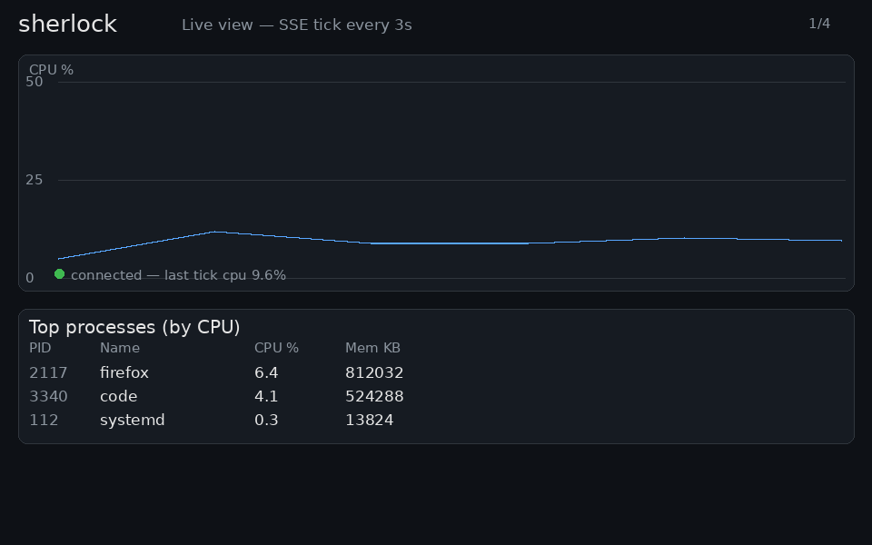

# sherlock — "Why Is This Slow"

Local Rust observability agent: samples system metrics every 3s, streams live via SSE, batches 60s windows into Postgres, and correlates spikes to processes.

## Stack

| Layer | Tech |
|-------|------|
| Agent | Rust + tokio + sysinfo (runs on the machine being monitored — local only by design) |
| Backend | Axum + SQLx + Postgres |
| Dashboard | SSE + Chart.js + Vite (separate dev server :5173) |
| Infra | Docker (local Postgres) — no cloud deploy; agent must stay local |

## Current Phase Status

| Phase | Status | What's done |
|-------|--------|-------------|
| 0 — Groundwork | ✅ | sysinfo polling, /proc understanding |
| 1 — Agent sampling | ✅ | Metric struct, ring buffer, 60s flush to stdout |
| 2 — Backend ingestion | ✅ | Axum + Postgres batch POST (10-min E2E verified) |
| 3 — Live path | ✅ | SSE fan-out + Vite dashboard (live charts + top processes) |
| 4 — History + correlation | ✅ | Time-range queries + spike→process join + History tab |
| 5 — Polish + demo | ✅ | Hourly retention purge, README finish, demo GIF |

## Prerequisites

- Rust toolchain + `sqlx-cli` (`cargo install sqlx-cli --no-default-features --features postgres`)
- Postgres 16 (system service on :5432 — see `.env`; `docker-compose.yml` postgres is a stopped fallback)
- Node 18+ / npm (dashboard), `ffmpeg` (to reproduce the demo GIF)
- Copy env: `cp .env.example .env` (sets `DATABASE_URL`, `BACKEND_HOST/PORT`, `DASHBOARD_ORIGIN`, `RETENTION_HOURS=48`)

## Quick Start (Agent Only)

```bash
cd ~/Projects/sherlock
cargo run -p agent
# Watch CPU/mem scroll every 3s; every 60s the 20-sample buffer POSTs to
# the backend (needs it running — see below), otherwise it's kept for retry.
```

## Running Full Stack (Phase 2+)

```bash
# 1. Start Postgres (system service, or `docker compose up -d postgres`
#    if you prefer the container — see .env note)
# 2. Apply migrations
sqlx migrate run --source backend/migrations

# 3. Start backend
cargo run -p backend

# 4. Start agent (flush POSTs 20-sample batches to backend, publishes each tick for live)
cargo run -p agent
```

> **Local-only note:** the agent samples the machine it runs on, so it is
> intentionally never deployed. Only the backend + dashboard could be hosted;
> for this v1 everything runs on localhost.

## Retention (Phase 5)

Backend deletes raw `samples` older than `RETENTION_HOURS` (default 48h) on
startup + every `RETENTION_INTERVAL_SECS` (default 3600s).
`process_samples` are cleaned via `ON DELETE CASCADE`; live SSE ticks are
in-memory only and never persisted. At 3s sampling + top-10 processes/tick,
48h ≈ 57.6k samples + ~576k process rows. Tune via `.env`.

## Demo



Walkthrough rendered from a real spike run (4× `yes` + `sha256sum`,
peak 41.7%): live SSE view → deliberate spike → History tab (80 samples,
peak marked) → click spike → `GET /api/correlate` names the culprits
(`yes` ×4 + `sha256sum`, ~98% CPU each). To reproduce live: run the full
stack below, spike the CPU, then open History and click the peak.

## Live Dashboard (Phase 3)

```bash
# terminal 1: backend (needs DATABASE_URL)
cargo run -p backend
# terminal 2: dashboard
npm --prefix dashboard install
npm --prefix dashboard run dev   # http://localhost:5173
# terminal 3: agent
cargo run -p agent
```

## Project Structure

```
sherlock/
├── agent/              # Rust sampling binary
│   └── src/main.rs     # poll loop, buffering, batch POST flush
├── backend/            # Axum server
│   └── src/
│       ├── handlers/   # batch POST ✅; live SSE ✅; history ✅, correlate ✅
│       ├── models/     # ingest DTOs (BatchItem, ProcessItem, LiveSample)
│       ├── retention.rs # Phase 5: hourly DELETE of samples older than RETENTION_HOURS
│       └── db/         # PgPool setup
│   └── migrations/     # sqlx migrations (0001 samples + process_samples)
├── dashboard/          # Vite + Chart.js live + history views (SSE live, REST history/correlate)
├── docs/demo.gif       # Phase 5 demo: live → spike → history → correlate
├── schema.sql          # Postgres migrations
├── docker-compose.yml  # local Postgres
├── .env.example        # env template
├── api-spec.md         # endpoint schemas
├── ARCHITECTURE.md     # design decisions
├── PHASES.md           # phase plan + exit criteria
└── PRD.md              # problem statement + scope
```

## Known Limitations (v1)

- Agent crash loses ≤60s of unsent samples (ring buffer is in-memory)
- 3s sampling may miss sub-3s spikes (documented trade-off)
- Linux-first via sysinfo; Windows/Mac not guaranteed
- No network stats collected yet (net_rx/net_tx reserved in schema)
- No alerting, no multi-user, no fleet monitoring

## Notes for AI Handoff

- Agent flush POSTs 20-sample batches to `POST /api/metrics/batch` (keeps buffer + retries on failure)
- `ARCHITECTURE.md` describes target architecture; current state is end of Phase 5 (v1 done: storage + live + history/correlate + retention + demo)
- `PHASES.md` has the canonical phase order + exit criteria — follow that for sequencing